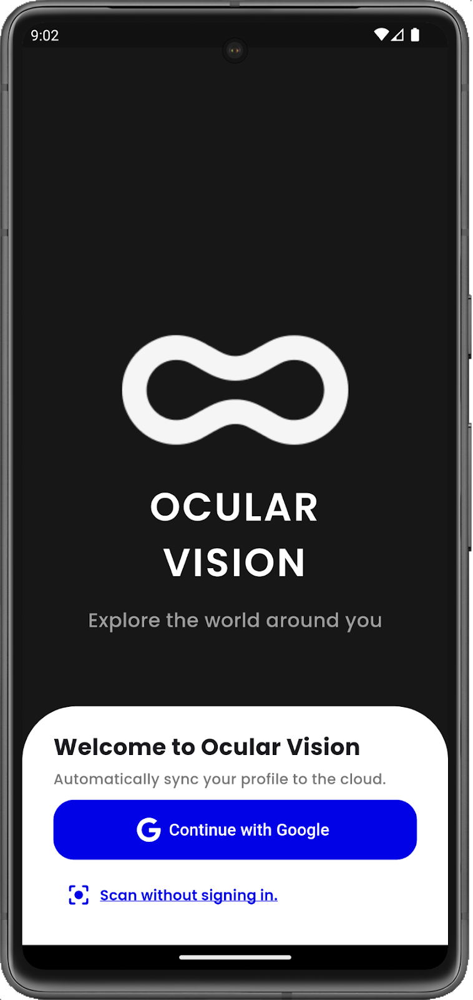
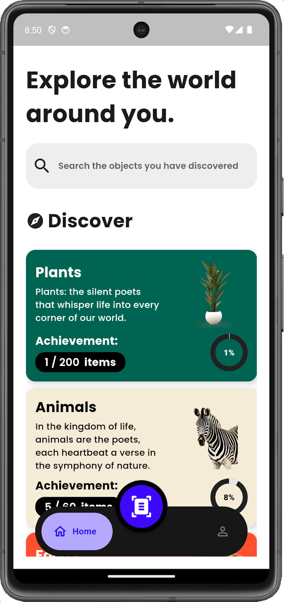
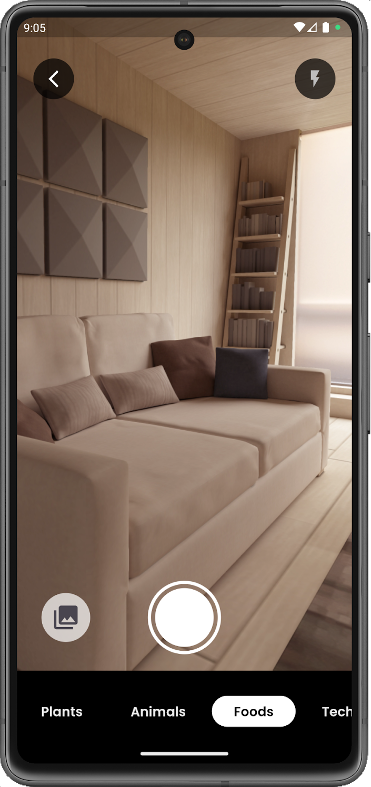
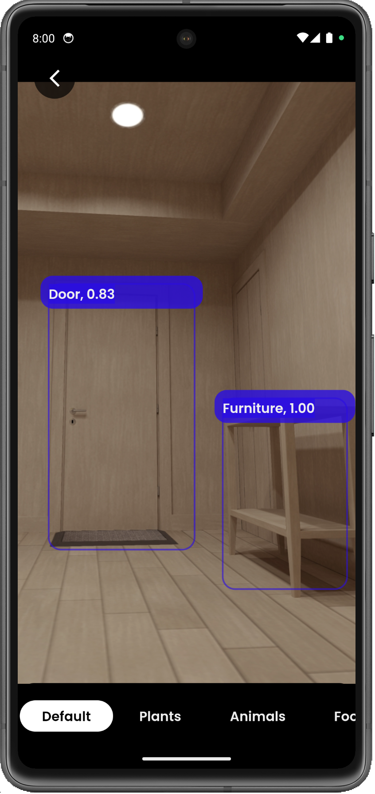
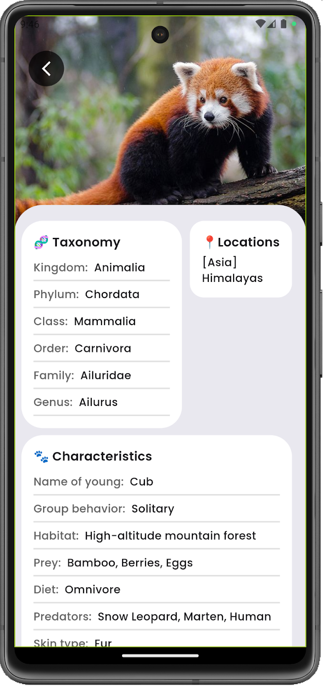

# Ocular Vision

**Ocular Vision** is driven by the fundamental goal of providing people with an easy and efficient tool to identify and interact with objects in their surroundings. With a focus on user-friendliness, the project enables quick item recognition through short, informative descriptions. Going beyond identification, the practical feature of storing traced images as a digital inventory, like bookmarks, adds convenience. The project's commitment to user engagement is demonstrated through achievement panels, encouraging exploration and interaction with different models. Ultimately, **Ocular Vision** aims to enhance daily interactions with the environment, offering a versatile and personalized tool for users to effortlessly identify, track, and engage with the objects around them.

<p align="center">

</p>


## Table of Contents

- [Features](#features)
- [Software Specifications](#software-specifications)
  - [Flutter](#flutter)
  - [Go](#go)
  - [TensorFlow Lite](#tensorflow-lite)
  - [MongoDB](#mongodb)
  - [Teachable Machine](#teachable-machine)
  - [AWS EC2](#aws-ec2)
  - [Docker](#docker)
- [APIs Used](#apis)
- [Installation](#installation)
- [Usage](#usage)
- [Screenshots](#screenshots)

## Features

- **Easy Object Identification**: Quickly recognize objects in your surroundings with short, informative descriptions.
- **Digital Inventory**: Store traced images as bookmarks for easy access and tracking.
- **Achievement Panels**: Encourage exploration and interaction with various models through achievement panels.

## Software Specifications

- **Flutter**
- **Go**
- **TensorFlow Lite**
- **MongoDB**
- **Teachable Machine**
- **AWS EC2**
- **Docker**

## APIs Used
1. **API ninjas**
   API ninjas provides different varities of APIs.
   Get your API key from [API-Ninjas](https://api-ninjas.com/) website. And update the key in ***./ocular_vision/lib/src/APIs/info_fetching.dart***

3. **Pexels**
   Pexels provides images as per our need.
   Get your API key from [Pexels](https://www.pexels.com/api/) website. And update the key in ***./ocular_vision/lib/src/screens/info_screen.dart***

## Installation

1. **Clone the repository:**

    ```bash
    git clone https://github.com/Codewire-github/ocular-vision.git
    cd ocular-vision
    ```

2. **Install dependencies:**

    For Flutter:
    ```bash
    flutter pub get
    ```

    For Go:
    ```bash
    go get
    ```

    For Docker:
    ```bash
    docker-compose up
    ```

3. **Set up MongoDB:**

    Follow the instructions on the [MongoDB installation guide](https://docs.mongodb.com/manual/installation/).

4. **Configure AWS EC2:**

    Set up your AWS EC2 instance by following the [AWS EC2 getting started guide](https://docs.aws.amazon.com/AWSEC2/latest/UserGuide/getting-started.html).

## Usage

1. **Start the Flutter application:**

    ```bash
    flutter run
    ```

2. **Run the Go backend server:**

    ```bash
    go run main.go
    ```

3. **Docker deployment:**

    ```bash
    docker-compose up --build
    ```

## Screenshots

### Home Screen

<p align="center">

</p>

### Camera Screen

<p align="center">

</p>

### Live Object Detection Screen

<p align="center">

</p>

### Info Screen for Foods

<p align="center">

</p>

### Info Screen for Animals

<p align="center">

</p>

